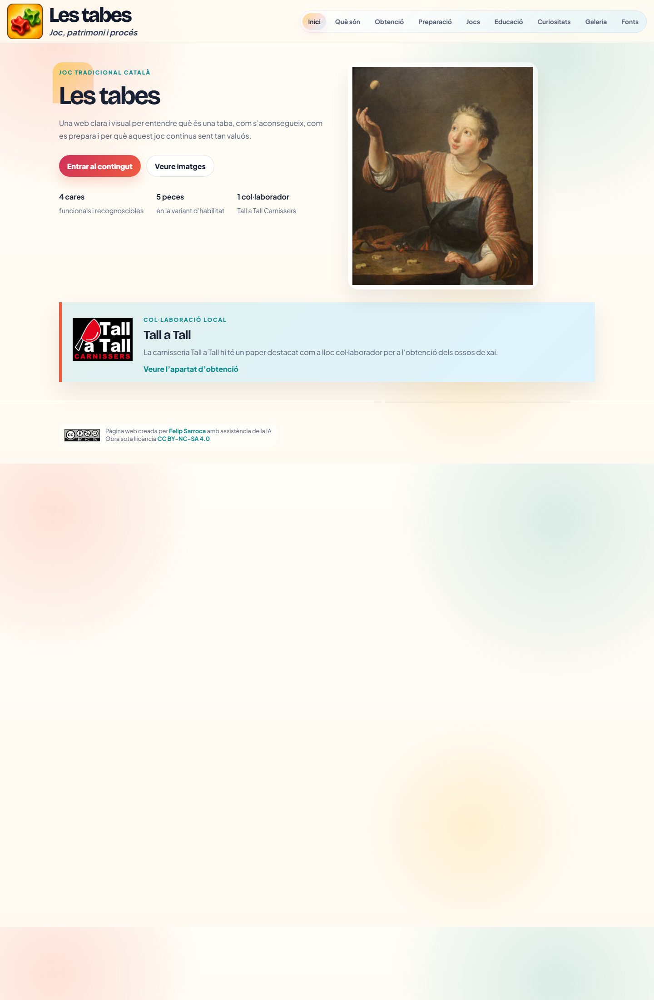
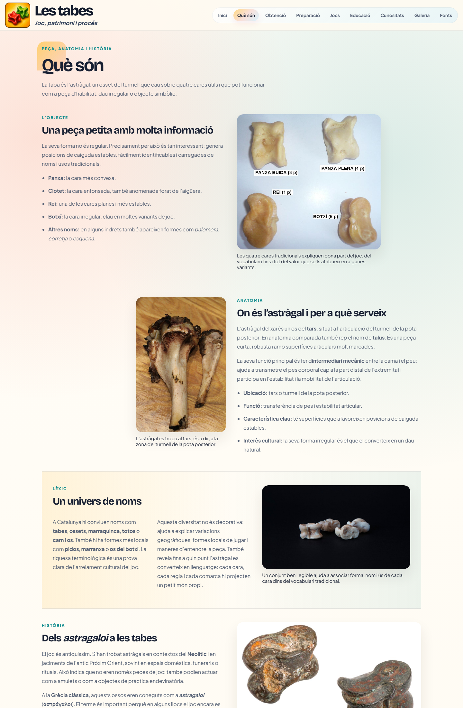
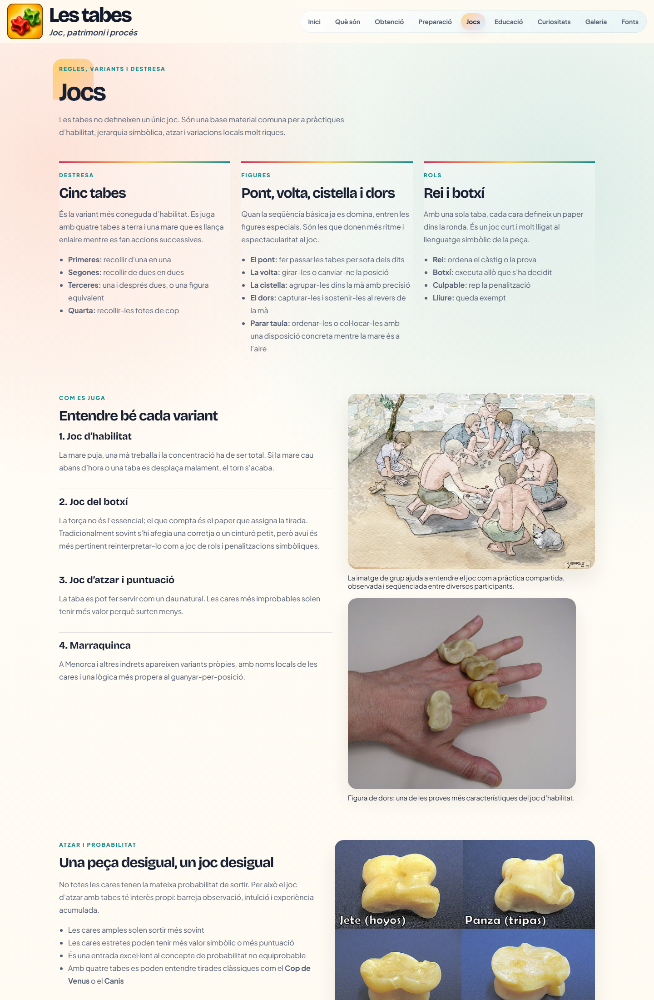
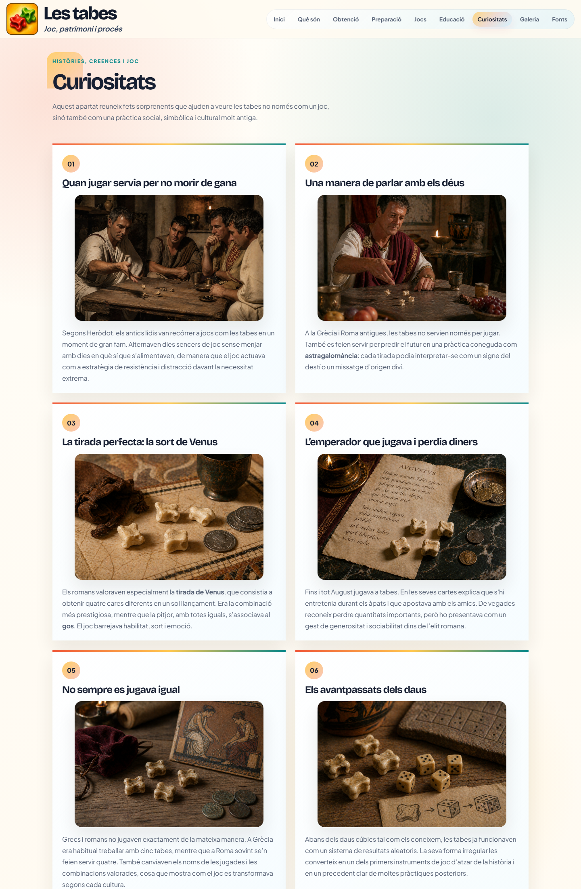
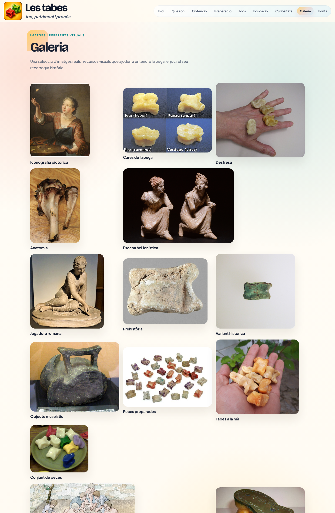

# Les tabes

Pàgina web en HTML, CSS i JavaScript sobre el món de les tabes: història, anatomia, obtenció, preparació, variants de joc, educació, curiositats i galeria visual.

## Captures de pantalla

### Inici

### Què són

### Jocs

### Curiositats

### Galeria

